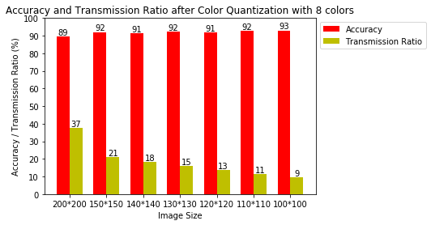
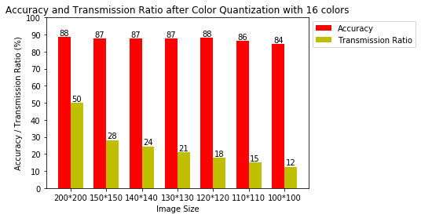
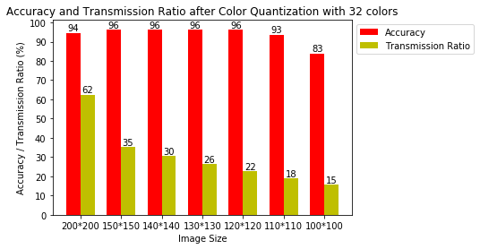
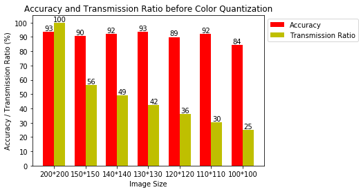
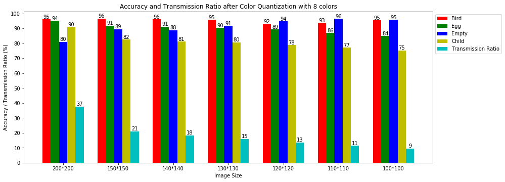
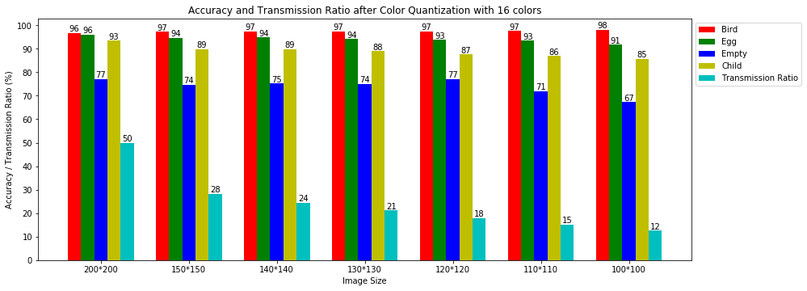
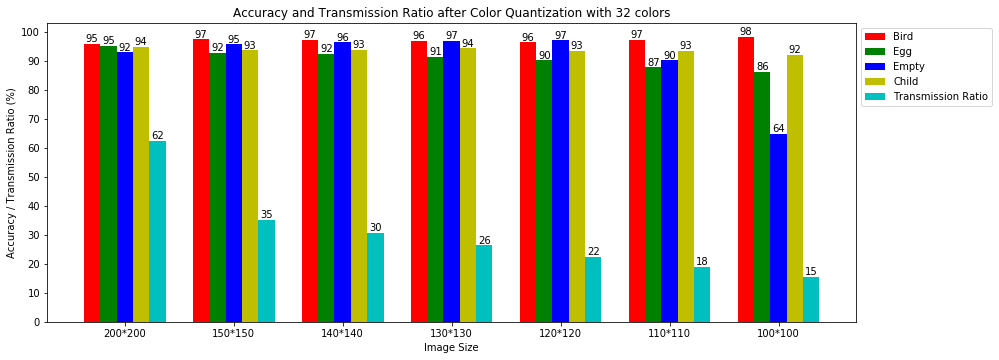
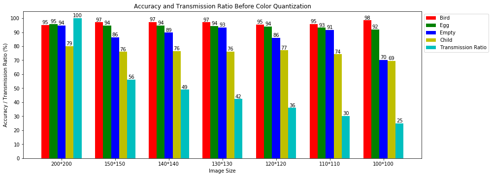

# BirdCNN

* 딥러닝의 발전함에 따라 이미지 분류 도메인의 주도권은 traditional 머신 러닝 알고리즘 (SVM, Linear Classifier)에서 ConvNN으로 주도권이 넘어감.
* ConvNN을 실생활에 적용하기 위해서 의미있고 실용적인 이미지를 수집하는 것이 필요함
* 또 실제 모델을 Deploy하는 시나리오도 필요함
* 이미지를 수집하는 것에는 Wireless Image Sensor Networks (WISN)가 하나의 해결책이 될 수 있음
* 하지만 WISN 상에서 멀티미디어 데이터를 전송하는 것은 전력소모가 크기 때문에 원본 이미지를 전송하는 것은 에너지 비효율적임
* 이 문제를 해결하기위해 Image resize와 Color Quantization을 사용하려고 함.
* WISN 상의 노드가 원본 이미지를 전송하지 않고 Image Quality를 감소시켜 전송량을 줄여도 ConvNN 결과에 크게 영향을 미치지 않고 충분하다는 것
* 전송량 측면에서 50% 이하로의 전송량 감소 시 96% 이상의 분류 정확도, ~%의 에너지 감소를 보임을 알아냄.

**모니터링, 분류하기 위해서 CNN을 사용할 때, Training이나 Prediction과정에서 이미징 센서를 부착한 노드가 굳이 RAW이미지를 보내지 않아도 Classification Accuracy에 크게 문제가 되지 않는다는 것, 적당한 이미지 프로세싱을 통해서 에너지 소비량이 훨씬 적어진다는 것.**

# Motivation or Challenge
이미지셋 설명

CNN을 사용한 이유

* 새의 종(species)에 따른 어려움을 해결
* 단채널 grayscale image에도 잘 동작한다는 점
* Color histogram이 uniform distribution해도 잘 동작한다는 점

이미지를 새, 새끼새, 알, 빈둥지로 클래스를 나눈다. 새의 종류 2개, 새끼새, 알, 빈둥지의 여려가지 이미지 첨부

이 때 새의 종류가 2개 인 점, 새끼새의 경우 청소년새가 포함되어 있는 점, 알이 둥지 밑에 숨어있는 점 등을 제시한다.
    
    -> traditional ML알고리즘 사용 결과 좋지 않았던 것과 사용이 힘든 이유

Data Driven으로 해결함. 선행연구[Ko et al., "Heartbeat of Bird Nest"] 기준 모든 면에서 Accuracy 증가.

# Image Preprocessing for reducing transmission amount
임베디드 디바이스에서 쉽게 구현 및 적은 계산량, 적은 에너지 소모가 필수적이다.

preprocessing 된 이미지 몇개 예시(SSIM, PSNR, MSE 등의 Image distortion metric과 같이)

## Previous Approach
* Find ROI and Crop
    * 임베디드 디바이스가 ROI를 잘 찾아서 ROI만 전송할 수 있다면 Traditional Image classifier에서는 잘 동작할 수 있다. 하지만 ROI 검출은 SIFT, SURF 등의 복잡한 알고리즘이 필요하다. 또는 시계열 이미지에서 이전 이미지와 현재 이미지간의 차이를 통해 변화한 부분을 ROI로 사용하는 방법도 있다. 그러나 원본 이미지가 grayscale 단채널이어서 색상정보가 부족하다는 점, 그에 따른 Pixel histogram이 각 Class마다 차이가 많이 나지않아 classification accuracy가 상당히 낮게 나온다.
    * ConvNN의 경우 학습된 데이터에 따라서 Validation이 진행되는데 학습시키는 과정에서 ROI를 추출해서 학습시키기가 어려운 점, ConvNN의 경우 완벽하게 잘리지 않은 이미지에 대해서 검출이 어려운 점 때문에 ROI Crop 방법은 적절하지 않다. 그래서 이미지의 전체 크기를 줄이기로 함.
    * 이 경우 픽셀정보는 바뀌겠지만 수정된 사진에 원본이미지의 내용이 모두 들어가게됨 - ConvNN에 적합

## Approach
* Image Scaling
    * Bilinear Image Scaling(이중선형 보간법)
        * Interpolation(인터폴레이션, 보간)이란 알려진 지점의 값 사이(중간)에 위치한 값을 알려진 값으로부터 추정하는 것을 말한다.
            * 출처 : http://darkpgmr.tistory.com/117 [다크 프로그래머]
            * 출처 : http://tech-algorithm.com/articles/bilinear-image-scaling/
        * 출처에 있는 내용들 조금 이야기
        * 간단한 Psuedo code box 필요할지 모르겠지만 10~14줄 정도

* Image Color Quantization
    * Color Quantization은 원본 이미지의 256색을 모두 사용하는 것이 아닌 일정 수의 표현 가능한 픽셀 수로 줄여서 사용하는 것이다.
    * Color Quantization의 방법에는 "straight-line distance", "nearest color" algorithm, K-means 방식 등이 있다.
        * Time complexity, Space Complexity가 높다.
        * 낮은 Distortion(SSIM, PSNR Metric 상)을 유발하는 Algorithm이 좋은 Accuracy result를 줄 수 있겠지만 여러번의 iteration을 거치는 것 또는 Pixel간의 euclidean distance 등을 계산하는 복잡한 것이 아닌 **정해진 Color pixel을 고정해서 Quantization을 수행함으로 더 적은 연산을 통해 Color Quantization을 할 수 있다.**

    * time complexity : O(n^2) (n : length of width)
        * Training도 Color Quantization한 이미지를 사용할 경우 낮은 Distortion이 크게 문제가 되지 않을 것이다.
        * Color Quantization 후 이미지의 사이즈(bytes) 계산 식
            * log(2)(# of Colors) * # of pixel
        * 정해진 Color Pixel 구하는, 이미지에 Color Quantization 적용하는 psuedo code box
```C
unsigned char get_nearest_centroid(unsigned char pixel) //O(1)
{

        unsigned char div = 256 >> logK;
        unsigned char sub = 2 << ((8-logK-1)) -1;
        unsigned char ret = (pixel - sub) / div;

        if((pixel-sub)%div > sub+1)
        {
                ret = ret + 1;
        }
        return ret;
}

//header size = 1078
void drop_image_quality(unsigned char image[41078]) //O(n^2), n is Width of an image
{
        int i;
        for(i = 1078; i < WIDTH_SQUARE+1078; i++)
        {
                printf("%d ", get_nearest_centroid(image[i]));
        }

}
```    

[표] Compression ratio

|너비|높이|8 Colors|16 Colors|32 Colors|256 Colors|
|---|---|---|---|---|---|
|100|100|9%|13%|16%|25%|
|110|110|11%|15%|19%|30%|
|120|120|14%|18%|23%|36%|
|130|130|16%|21%|26%|42%|
|140|140|18%|25%|31%|49%|
|150|150|21%|28%|35%|56%|
|160|160|24%|32%|40%|64%|
|170|170|27%|36%|45%|72%|
|180|180|30%|41%|51%|81%|
|190|190|34%|45%|56%|90%|
|200|200|38%|50%|63%|100%|

# Image Classification Using ConvNN

## Training model

* 사용한 툴(Caffe), 사용한 모델(GoogleNet), 모델 파라미터??(Deep Learning을 중심적으로하는 학회에서는 재현성을 위해 파라미터를 공개한다고 합니다. 근데 파라미터가 Optimal한 지에 대해 자신이 없네요.. 제 생각엔 새로운 Deep learning 알고리즘이 중심이 아닌 것 같아 자세하게 안해도 될 것 같습니다.)

### Image Augmentation
* 새, 빈둥지의 사진은 상대적으로 많을 수 밖에 없다. 그래서 알, 새끼새의 경우 많은 Image Augmentation을 통해 Class bias를 해결한다.
* 새 사진도 2가지의 종(species) 중 Bluebird 이미지의 수가 2배 정도 적다.
* Image Augmentation
    * Bluebird -> 2배 (vertical&horizontal flip)
    * Swallow -> 2배 (vertical&horizontal flip)
    * Egg -> 9배
        * Crop(1,2,3,4사분면, 가운데를 150 * 150으로 자르고 200 * 200으로 리사이즈)
        * Vertical, Horizontal, vertical&horizontal flip
    * Child -> 9배
        * Crop(1,2,3,4사분면, 가운데를 150 * 150으로 자르고 200 * 200으로 리사이즈)
        * Vertical, Horizontal, vertical&horizontal flip
    * Empty -> No Augmentation

[표] training 이미지 개수와 augmentation 후의 개수

|Class|# of orinal images|# of augmented images|
|---|---|---|
|Bird|8606|17212|
|Child|1841|16569|
|Egg|1036|9324|
|Empty|6977|Not applied|
|Total|18460|50082|

## Training
K Color Quantization된 이미지를 사용해서 Training 후 Validation을 K Color Quantization, Resized된 이미지를 사용함.
* Training Data를 모으는 과정에서도 에너지 소비를 줄일 수 있음.
* Labeling은 사람이 해야하므로 양질의 Data Labeling을 위해서 PSNR, SSIM, MSE가 여기서도 중요하다.
    * 원본 이미지도 사람이 구별하기 힘든 경우가 있음.
    * 구별 어려운 사진 예시

# Evaluation
1. 전송량 대비 Image Classification Accuracy
    * Validation 이미지 개수 및 설명
    * [표] Confusion Matrix
    * [그래프] Class 별 Accuracy
    * 그래프 형식은 아래와 같이
    * ~~분류 정확도를 떨어뜨리는 요인 중 하나는 청소년새들!~~
        * **Data Driven(Augmentation)으로 해결함.**
        * 청소년 새들을 제외하고 기존 방법으로 Training을 해봤는데 효과는 있었으나 별로 크지않았습니다.

참고) Child Class


위 3개의 이미지가 같은 클래스로 labeling 되어있음. -> '새' 클래스의 경우 완전한 성조가 있는 경우

Classification Result

이전 결과에 비해 높은 정화도를 보이는 이유는 기존에 제가 Training set과 Test set의 차이를 거의 1:1로 사용하고 있었습니다.
보다 좋은 Training을 위해 Training Set 개수를 늘렸습니다. 











---

2. Image Distortion Metric (SSIM, PSNR, MSE)

    
    
    
    
실제 전송받은 사진을 가지고 다른 작업을 할 때 필요할 수 있음. (# of eggs, # of child bird..)

3. Energy Consumption(내주 내로 측정예정)
    * Resize(150, 140, 130, 120, 110, 100)
    * Color Quantization(8, 16, 32 Colors)
    * Transmission

[표] Resize Energy Consumption

|Resolution|Average Running Time(s)|Est. energy usage (mJ)|
|---|---|---|
|200 to 100|0.68|21|
|200 to 110|0.88|27|
|200 to 120|1.0|33|
|200 to 130|1.26|40|
|200 to 140|1.46|46|
|200 to 150|1.67|53|

[표] Color Quantization

**컬러 개수와 상관없이 동일한 전력소비를 보임**

|Average Running Time(ms)|Est. energy usage (mJ)|
|---|---|
|1|0.019|

[표] Transmit Raw Image(Idle - 3mA, Radio_ON - 12mA)
|Average Running Time(ms)|Est. energy usage (mJ)|

# Related work

# conclusion


